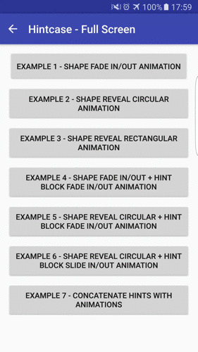

HintCase
==================

HintCase is a library for Android that will help you create really awesome hints/tips for your apps. You can find a secondary library (HintCaseAssets) with multiple content holders and animators that you can use with HintCase library. Take a look to how you would integrate HintCase into your app.

With HintCase library you can apply shape animations to highlight a specific view and show a HintBlock and/or multiple ExtraBlocks all of them with optional animations to show/hide them. All is very easy, but if you don't have time to implement shapes, blocks and animations, with the HintCaseAssets library you can use some predefined items.

[](http://www.youtube.com/watch?v=GT3D-kJrKAA)&nbsp;&nbsp;&nbsp;&nbsp;&nbsp;&nbsp;[](http://www.youtube.com/watch?v=1O-SRAZqYAo)

## Latest Version

[ ](https://bintray.com/joanfuentes/maven/HintCase/_latestVersion)    [](http://android-arsenal.com/details/1/3707)


## How to use

### 1.- Configuring your Project Dependencies

Add the library dependency to your build.gradle file.

```groovy
dependencies {
    ...
    compile 'com.joanfuentes:HintCase:1.0.4'
}
```

#### 1.1- Optional Project Dependency

You can add the optional assets library dependency to your build.gradle file.

```groovy
dependencies {
    ...
    compile 'com.joanfuentes:HintCaseAssets:1.0.4'
}
```

### 2.- Showing a Hint

All you need to do is create a new HintCase object, configure it and call the **show()** method.

#### 2.1.- Passing a view to the constructor

You need to pass a view to the constructor of HintCase object. This view should be the parent where you want to show the Hint.
For example, is you are executing it from an onClick event, you could use a **view.getRootView()**, and **from an activity** you can use **getActivity().getWindow().getDecorView()** to get the full screen view.

```java
protected void showHint() {
    ...
    parentView = getActivity().getWindow().getDecorView();
    new HintCase(parentView)
                ...
                .show();
}
```

#### 2.2.- Configuring a Target (OPTIONAL)

You can configure a target view which will be highlighted. You can then configure the shape type, a margin between the shape and the target view (named offset) and if the target should be clickable or not.

If no offset is specified, the default offset value is 10dp.

```java
    .setTarget(findViewById(R.id.textView), new RectangularShape(), HintCase.TARGET_IS_NOT_CLICKABLE)
```

By default, if Target is not configured, a rectangular shape is used, the whole parent view is used as target, there is no offset and the target is not clickable.

In HintCaseAssets you can find an extra shape (CircularShape), which is ideal to use with action menu icons, and FAB buttons.

#### 2.3.- Configure animations to show/hide shapes (OPTIONAL)

You can show animations when you show/hide a target with a shape. To do it, call the method **setShapeAnimators(..)**. 
You can use a ShapeAnimator to show and another ShapeAnimator to hide. You can find some ShapeAnimators in HintCaseAssets library. Feel free to use them or create your own awesome animators.

##### FadeInShapeAnimator and FadeOutShapeAnimator

Fade in/out effects. You can set the time in the constructor. If no time is specified, 300ms are the default value.
You can configure a delay for the animation with setStartDelay(long startDelayTimeInMillis).

[](http://www.youtube.com/watch?v=67MZVrnhaAI)

##### RevealCircleShapeAnimator and UnrevealCircleShapeAnimator

Reveal/Unreveal effects to highlight a target with a circle shape. You can set the time in the constructor. If no time is specified, 300ms are the default value.
You can configure a delay for the animation with setStartDelay(long startDelayTimeInMillis).

[](http://www.youtube.com/watch?v=-U4Ish1NKSM)

##### RevealRectangularShapeAnimator and UnrevealRectangularShapeAnimator

Reveal/Unreveal effects to highlight a target with a rectangular shape. You can set the time in the constructor. If no time is specified, 300ms are the default value.
You can configure a delay for the animation with setStartDelay(long startDelayTimeInMillis).

[](http://www.youtube.com/watch?v=6Nd-1CaLyQI)

Finally to configure shapeAnimators you need to call:

```java
    .setShapeAnimators(new RevealRectangularShapeAnimator(), ShapeAnimator.NO_ANIMATOR)
```

If you don't want an animation you can use ***ShapeAnimator.NO_ANIMATOR***

#### 2.4.- Configure a Background color (OPTIONAL)

You can specify a background color for the shape of the hint. You can use:

```java
    .setBackgroundColor(0x00000000)
```
 or
```java
     .setBackgroundColorByResourceId(R.color.colorPrimary)
```

#### 2.4.- Configure to close the hint on click on it (OPTIONAL)

By default, the hint is closed when the user click on it. If you don't want it, you can change this behavior with:

```java
    .setCloseOnTouchView(false)
```

#### 2.5.- Configure the Hint Block (OPTIONAL)

You can create a hint block which depends on the target position to show itself.
The hint block will be positioned on the biggest free space on the screen between the target view and the borders of the parent.
If no target was configured, the hint block will be positioned in the center of the parent view.
For example, if the parent view is the full screen, the hint block will be a view positioned in the center of the screen.

You can define your own HintContenHolder or use some of the existing in the HintCaseAssets library:

##### ByLayoutHintContentHolder

A HintContentHolder which inflates a specified layout. This is a fast way to create different hints with a specified layout for every hint.

```java
    ByLayoutHintContentHolder hintBlock = new ByLayoutHintContentHolder(R.layout.hint_welcome)
```

##### SimpleHintContentHolder

A HintContentHolder which can show a title, an image and a description. all 3 items are optional.

```java
    SimpleHintContentHolder hintBlock = new SimpleHintContentHolder.Builder(context)
               .setContentTitle(R.string.title)
               .setContentText(R.string.description)
               .setTitleStyle(R.style.title)
               .setContentStyle(R.style.content)
               .setImageDrawableId(R.drawable.happy_welcome)
               .build();
```

The image can be passed as an imageView instead of a drawable so, you can use awesome libraries as Glide to pass fabulous animated gifs. In that case you need to use the **.setImageView(imageView)** method.

Finally, you can configure ContentHolderAnimators to show or hide the hint block.

```java
    .setHintBlock(hintBlock, new FadeInContentHolderAnimator(), new FadeOutContentHolderAnimator())
```

If you don't want to create your own ContentHolderAnimators, you can use some existing in HintCaseAssets library as:

##### FadeInContentHolderAnimator and FadeOutContentHolderAnimator

Fade in/out effects. You can set the time in the constructor. If no time is specified, 300ms are the default value.
You can configure a delay for the animation with setStartDelay(long startDelayTimeInMillis).

[](http://www.youtube.com/watch?v=MGxyC1XZpXs)

##### SlideInFromRightContentHolderAnimator and SlideOutFromRightContentHolderAnimator

Slide in/out movements from right position. You can set the time in the constructor. If no time is specified, 300ms are the default value.
You can configure a delay for the animation with setStartDelay(long startDelayTimeInMillis).

[](http://www.youtube.com/watch?v=8ewF5wEz988)

#### 2.6.- Configure an Extra Block (OPTIONAL)

You can create multiple extra blocks which will be placed on a specified position of the parent view.

You can create your own ExtraContentHolders. You can find on HintCaseAssets library an example with SimpleButtonContentHolder:

##### SimpleButtonContentHolder

A HintContentHolder which show a button on the hint. It can be positioned based on rules of RelativeLayout.

```java
SimpleButtonContentHolder okBlock = new SimpleButtonContentHolder.Builder(context)
                        .setWidth(ViewGroup.LayoutParams.WRAP_CONTENT)
                        .setHeight(ViewGroup.LayoutParams.WRAP_CONTENT)
                        .setRules(RelativeLayout.ALIGN_PARENT_BOTTOM, RelativeLayout.ALIGN_PARENT_RIGHT)
                        .setButtonText(R.string.ok)
                        .setCloseHintCaseOnClick(true)
                        .setButtonStyle(R.style.buttonNice)
                        .build();
```

You can configure the button to close the hint on clock with **.setCloseHintCaseOnClick(true)** and define the button style with **.setButtonStyle(R.style.buttonNice)**.

Finally, you can configure ContentHolderAnimators to show or hide the extra block.

```java
    .setExtraBlock(okBlock, new SlideInFromRightContentHolderAnimator(), new SlideOutFromRightContentHolderAnimator())
```

If you don't want to create your own ContentHolderAnimators, you can use some existing in HintCaseAssets library.

#### 2.7.- Configure a listener when the hint is closed (OPTIONAL)

You can set a listener to execute when the hint is closed:

```java
    .setOnClosedListener(new HintCase.OnClosedListener() {
        @Override
        public void onClosed() {
            Snackbar.make(view, "Hint closed", Snackbar.LENGTH_SHORT).show();
        }
     })
```

### 3.- Concatenate several hints (OPTIONAL)

You can concatenate several hints simply using the OnClosedListener to launch the next HintCase. Even you can configure hints to avoid some animations so that the user does not perceive that are different hints.

For example:
```java
    SimpleHintContentHolder hintBlock = new SimpleHintContentHolder.Builder(view.getContext())
            .setContentTitle("Attention!")
            .setContentText("You can find here your notifications")
            .setTitleStyle(R.style.title)
            .setContentStyle(R.style.content)
            .build();
    new HintCase(view.getRootView())
            .setTarget(findViewById(R.id.textView), new CircularShape(), HintCase.TARGET_IS_NOT_CLICKABLE)
            .setBackgroundColor(getResources().getColor(R.color.colorPrimary))
            .setShapeAnimators(new RevealCircleShapeAnimator(), ShapeAnimator.NO_ANIMATOR)
            .setHintBlock(hintBlock, new FadeInContentHolderAnimator(), new SlideOutFromRightContentHolderAnimator())
            .setOnClosedListener(new HintCase.OnClosedListener() {
                @Override
                public void onClosed() {
                    SimpleHintContentHolder secondHintBlock = new SimpleHintContentHolder.Builder(view.getContext())
                            .setContentTitle("Notifications center is your best friend")
                            .setContentText("Every time you purchase a game, a notification will be generated")
                            .setTitleStyle(R.style.title)
                            .setContentStyle(R.style.content)
                            .build();
                    new HintCase(view.getRootView())
                            .setTarget(findViewById(R.id.textView), new CircularShape())
                            .setBackgroundColor(getResources().getColor(R.color.colorPrimary))
                            .setShapeAnimators(ShapeAnimator.NO_ANIMATOR, new UnrevealCircleShapeAnimator())
                            .setHintBlock(secondHintBlock, new SlideInFromRightContentHolderAnimator())
                            .show();
                }
            })
            .show();
```

In this example, the fist hint is configured to show a reveal animation for the shape but with no animation to hide the hint. The next hint doesn't show an animation to show so, the effect is that the shape was fixed and there was no change with it.
The hint block was showed with a fade in animation but to hide it was shown an slideOut animation, and the hint block in the next screen was showed with a slideIn animation.
The result was this:

[](http://www.youtube.com/watch?v=uyE6bNGVwGc)

### 4.- Building your own ContentHolder (OPTIONAL)

Building your own content holder is really easy. If you want that you contentHolder was showed on the biggest free space in the screen you should extend from HintContentHolder. Otherwise, if you want that your ContentHolder can fill all the parent view extends from ExtraContentHolder.
Both of the base classes (HintContentHolder and ExtraContentHolder) extends from ContentHolder and define its specific getParentLayoutParams to use in your custom ContentHolder.

In your custom ContentHolder you will need to define your own getView method to return the view that you generated for your hint.
You receive the context, the parent viewgroup and the full hintcase so you can even know where the target is to mount your own contentHolder.
```java
    @Override
    public View getView(Context context, final HintCase hintCase, ViewGroup parent) {
        ...
    }
```

as an optional you can define the onLayout method that you listen when the layout is inflated so you can configure your contentHolder based on the calculated position for the HintContentHolder
```ave
    @Override
    public void onLayout() {
        ...
    }
```
In the app example you can find a CustomHintContentHolder that override and use both methods.

### 5.- Building your own ContentHolderAnimator (OPTIONAL)

Building your own content holder animator is really easy. You should extend from ContentHolderAnimator.
 
 In Your custom ContentHolderAnimator you will need to define your own getAnimator method to return the ValueAnimator of the contentHolder.
 You receive the view for which is the animator applied and a onFinishListener to call when the animator is finished.

```java
    @Override
    public ValueAnimator getAnimator(View view, OnFinishListener onFinishListener) {
        ...
    }
```

### 6.- Building your own Shape (OPTIONAL)

A rectangular and a Circular shape are provided with the main library and the assets library, but if you need to do your own shape, you can do it!.

In your Shape you will need to define some methods:
```java
    @Override
    public void setMinimumValue() {
        ...
    }
    
    @Override
    public void setShapeInfo(View targetView, ViewGroup parent, int offset, Context context) {
        ...
    }
    
    public boolean isTouchEventInsideTheHint(MotionEvent event) {
        ...
    }
    
    public void draw(Canvas canvas) {
        ...
    }

```
- setMinimumValue : you should set the minimum size of the shape in this method.
- setShapeInfo : you should set all the necessary info of the shape for use on ShapeAnimators.
- isTouchEventInsideTheHint: this method should return if the user performed a touch event inside the Highlighted item.
- draw: this method should draw the shape in the canvas.

You can check the code of CircularShape & RectangularShape to se some examples.

### 7.- Building your own ShapeAnimator (OPTIONAL)

Building your own shape animator is really easy. You should extend from ShapeAnimator.
 
 In Your custom ShapeAnimator wou will need to define your own getAnimator method to return the ValueAnimator of the contentHolder.
 You receive the view on which is the animator applied, the shape to animate and a onFinishListener to call when the animator is finished.

```java
    @Override
    public ValueAnimator getAnimator(View view, Shape shape, OnFinishListener onFinishListener) {
        ...
    }
```

## Developers

* Joan Fuentes ([@Nescafemix](https://github.com/nescafemix))

## Special Thanks to

* Txus Ballesteros ([@Txusballesteros](https://github.com/txusballesteros))

## Motivation

We created this view as a little piece of the [Redbooth](https://redbooth.com/) app for [Android](https://play.google.com/store/apps/details?id=com.redbooth).

## Currently using in

* [Redbooth](https://play.google.com/store/apps/details?id=com.redbooth)

If you use this library in your project and you want to be in this section, please, let us know it at [@Nescafemix](https://twitter.com/Nescafemix).

## License

Copyright Joan Fuentes 2016

This file is part of some open source application.

Licensed to the Apache Software Foundation (ASF) under one
or more contributor license agreements.  See the NOTICE file
distributed with this work for additional information
regarding copyright ownership.  The ASF licenses this file
to you under the Apache License, Version 2.0 (the
"License"); you may not use this file except in compliance
with the License.  You may obtain a copy of the License at

  http://www.apache.org/licenses/LICENSE-2.0

Unless required by applicable law or agreed to in writing,
software distributed under the License is distributed on an
"AS IS" BASIS, WITHOUT WARRANTIES OR CONDITIONS OF ANY
KIND, either express or implied.  See the License for the
specific language governing permissions and limitations
under the License.
